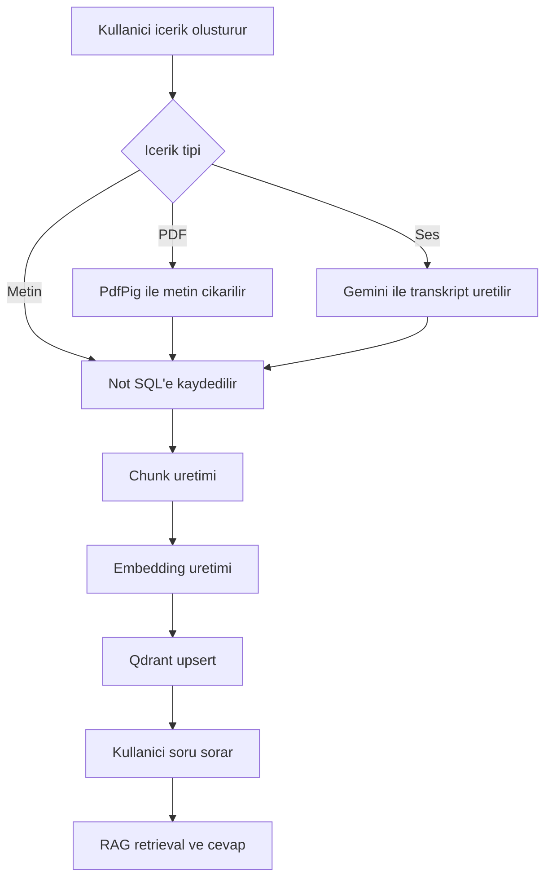

# 01 - Proje Genel Bakis

## Kapsam

Notisight, kisisel not yonetimi ile yapay zeka destekli bilgi getirme mimarisini birlestiren bir web uygulamasidir. Kullanici metin notu olusturabilir, PDF veya ses dosyasi yukleyebilir, klasor ve etiketlerle bilgi alanini duzenleyebilir ve AI asistanina notlari uzerinden soru sorabilir.

## Temel Ozellikler

| Ozellik | Aciklama | Mevcut durum |
|---|---|---|
| Kullanici hesabi | Kayit, giris, profil ve parola yonetimi | Uygulandi |
| Not yonetimi | Not olusturma, guncelleme, silme | Uygulandi |
| Klasor hiyerarsisi | Ic ice klasorler ve not tasima mantigi | Uygulandi |
| Etiketleme | Not-etiket iliskisi | Backend uygulandi |
| PDF yukleme | PDF metni cikarilip not olarak saklanir | Uygulandi |
| Ses yukleme | Ses dosyasi transkripte donusturulur | Uygulandi |
| Ses kaydi | Tarayici mikrofonu ile kayit alip upload eder | Uygulandi |
| AI sohbet | Standard ve Notisight modlari | Uygulandi |
| RAG cevaplama | Notlardan kaynakli cevap uretimi | Uygulandi |
| Citation | Cevaptaki kaynak chunk kimliklerinin UI'a yansimasi | Uygulandi |
| AI ton secimi | Samimi, teknik, ogretici, resmi tonlar | Uygulandi |
| AI saglayici ayarlari | Kullanici bazli API anahtari ve model secimi | Uygulandi |

## Kullanici Senaryolari

| Senaryo | Akis |
|---|---|
| PDF uzerinden soru sorma | PDF yuklenir, metin cikarilir, chunk ve embedding uretilir, kullanici Notisight modunda soru sorar |
| Ses kaydini bilgiye donusturme | Kullanici ses kaydi alir, backend transkript uretir, transkript not olarak kaydedilir |
| Kisisel notlardan cevap alma | Notlar SQL'de saklanir, Qdrant'a indekslenir, ilgili chunk'lar LLM baglamina eklenir |
| Serbest AI sohbeti | Standard mod secilir, RAG hattina girmeden LLM'e mesaj gonderilir |

## Mevcut Kapsam

Uygulama monorepo icinde backend, frontend, test ve dokuman klasorleri ile gelistirilmistir. Backend ASP.NET Core Web API, frontend Vite/React tabanlidir. RAG hatti not yasam dongusune baglanmistir: not olusturma, guncelleme ve silme islemleri Qdrant tarafindaki vektorleri de etkiler.

## Sinirliliklar

| Sinirlilik | Etki | Gelistirme onerisi |
|---|---|---|
| Command palette arama sonuclari statik ornekler icerir | Gercek not aramasi yapmaz | Backend arama endpointiyle baglanabilir |
| SessionContext memory cache'te tutulur | Uygulama yeniden baslayinca oturum baglami kaybolur | Persistent session context tablosu eklenebilir |
| Intent parser fallback kural tabanlidir | LLM hatasinda daha basit niyet cikarimi olur | Daha genis dil kural seti eklenebilir |
| Audio timestamp tahmini yaklasiktir | Kaynak zaman isaretleri kesin degildir | Gercek forced alignment veya segmentli transkripsiyon eklenebilir |

## Genel Akis

