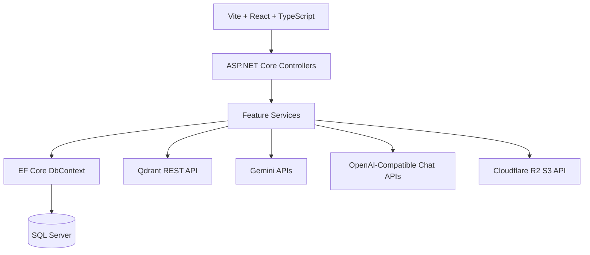

# 02 - Teknoloji Yigini

## Genel Bakis

Notisight'in teknoloji secimleri iki hedefe dayanir: guvenilir veri yonetimi ve AI destekli bilgi getirme. Backend tarafinda .NET ekosistemi, frontend tarafinda Vite/React, AI katmaninda Qdrant ve LLM servisleri kullanilir.

## Backend Teknolojileri

| Teknoloji | Surum / paket | Kullanim amaci |
|---|---|---|
| .NET | net8.0 | API calisma zamani |
| ASP.NET Core Web API | Microsoft.NET.Sdk.Web | Controller, middleware ve endpointler |
| Entity Framework Core | 8.0.4 | ORM, migration, SQL Server baglantisi |
| SQL Server provider | Microsoft.EntityFrameworkCore.SqlServer | Production veritabani |
| JWT Bearer | Microsoft.AspNetCore.Authentication.JwtBearer | Access token dogrulama |
| BCrypt.Net-Next | 4.0.3 | Parola hashleme |
| Swashbuckle | 6.6.2 | Swagger/OpenAPI |
| UglyToad.PdfPig | 1.7.0-custom-5 | PDF metin cikarimi |
| AWS SDK S3 | 4.0.24 | Cloudflare R2 ile S3 uyumlu dosya islemleri |

## Frontend Teknolojileri

| Teknoloji | Kullanim |
|---|---|
| Vite | Gelistirme sunucusu ve build |
| React 19 | UI bileşenleri |
| TypeScript | Tip guvenligi |
| Tailwind CSS v4 | Utility-first stil sistemi |
| TipTap | Rich text editor |
| react-pdf | PDF goruntuleme |
| lucide-react | Ikonlar |
| motion | Animasyonlar |
| react-markdown | AI cevaplarinda Markdown render |

## AI ve RAG Teknolojileri

| Bilesen | Teknoloji | Not |
|---|---|---|
| Embedding | Gemini embedding modeli | Dokuman ve sorgu embedding uretimi |
| Audio transcription | Deepgram API | Ses dosyasini metne cevirme |
| Vector store | Qdrant | Cosine distance ile semantic search |
| Chat LLM | OpenAI-compatible `/chat/completions` | OpenAI, DashScope, Gemini OpenAI-compatible, DeepSeek, OpenRouter, Grok vb. |
| Retrieval | Hybrid vector + keyword | RRF ile birlestirme |

## Test Teknolojileri

| Teknoloji | Rol |
|---|---|
| xUnit | Test framework |
| Microsoft.AspNetCore.Mvc.Testing | In-memory API test ortami |
| EF Core SQLite | Testte in-memory relational DB |
| Fake Qdrant service | Vektor islemlerini kaydetme ve hata simule etme |
| Fake audio transcription | Ses transcription testlerini dis servissiz calistirma |

## Mimari Katman Haritasi

## Mevcut Implementasyon Notu

Projenin kok README dosyasinda tarihsel plan olarak Next.js hedefi gecmektedir. Kaynak kod incelendiginde mevcut frontend'in Vite ve React ile kuruldugu gorulmektedir. Bu nedenle tez dokumantasyonunda teknoloji yigini Vite/React olarak ele alinmalidir.
