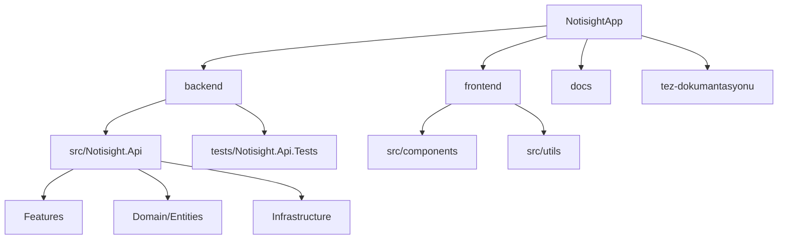

# 03 - Dosya ve Klasor Yapisi

## Monorepo Yapisi

Proje tek bir kok klasor altinda backend, frontend, dokuman ve test parcalarini barindirir. Bu yapi, bitirme projesi icin tum teknik varliklarin ayni yerde izlenmesini kolaylastirir.

```text
NotisightApp/
  backend/
    src/Notisight.Api/
    tests/Notisight.Api.Tests/
    scripts/
    sql/
  frontend/
    src/
    package.json
    vite.config.ts
  docs/
    checklists/
    walkthroughs/
  tez-dokumantasyonu/
  README.md
  Notisight.slnx
```

## Backend Kaynak Hiyerarsisi

| Klasor | Rol |
|---|---|
| `Domain/Entities` | Temel veri varliklari |
| `Features/Auth` | Kimlik dogrulama controller, contract ve servisleri |
| `Features/Notes` | Not CRUD islemleri |
| `Features/Folders` | Klasor hiyerarsisi ve CRUD |
| `Features/Tags` | Etiket yonetimi |
| `Features/AI` | RAG, LLM, embedding, retrieval, session context |
| `Features/Ingestion` | PDF, ses, dosya upload ve storage |
| `Features/Settings` | AI saglayici ayarlari ve API key saklama |
| `Infrastructure` | Auth helper, hata yonetimi, persistence, HTTP retry |
| `Options` | Config section siniflari |
| `Extensions` | DI ve middleware pipeline extension'lari |

## Frontend Kaynak Hiyerarsisi

| Klasor / dosya | Rol |
|---|---|
| `src/App.tsx` | Auth/app/settings gorunum secimi |
| `src/components/Dashboard.tsx` | Ana 3 panelli calisma alani |
| `src/components/AIAssistant.tsx` | AI sohbet paneli, SSE parsing, tone/model secimi |
| `src/components/Editor.tsx` | TipTap tabanli not editoru |
| `src/components/Sidebar.tsx` | Klasor ve not agaci |
| `src/components/KnowledgeIngestionModal.tsx` | PDF/ses yukleme |
| `src/components/VoiceRecorderModal.tsx` | Tarayici ses kaydi |
| `src/components/PdfViewer.tsx` | PDF goruntuleme |
| `src/components/AudioViewer.tsx` | Ses oynatma ve transkript |
| `src/utils/apiClient.ts` | JWT ve refresh destekli API istemcisi |
| `src/utils/folderUtils.ts` | Agac yapisi yardimci fonksiyonlari |

## Test Hiyerarsisi

| Dosya | Test kapsami |
|---|---|
| `AuthLifecycleTests.cs` | Register, login, refresh, logout, profil, parola |
| `CrudIsolationTests.cs` | Kullanici izolasyonu, klasor parent kontrolleri |
| `NoteVectorLifecycleTests.cs` | Not create/update/delete ve Qdrant sync |
| `IngestionEndpointTests.cs` | PDF/ses upload validasyonlari |
| `AiStreamingTests.cs` | SSE cevap ve kaynak referansi |
| `JwtTokenServiceTests.cs` | JWT token uretimi |

## Uretilmis ve Yerel Klasorler

| Klasor | Aciklama | Tezde nasil ele alinmali |
|---|---|---|
| `frontend/node_modules` | NPM bagimliliklari | Kaynak kod olarak incelenmez |
| `frontend/dist` | Vite build ciktisi | Deploy ciktisi |
| `backend/**/bin` | .NET build ciktisi | Kaynak degil |
| `backend/**/obj` | .NET ara ciktisi | Kaynak degil |
| `.nuget`, `.dotnet`, `.npm-cache` | Local cache | Tez kapsaminda degil |

## Hiyerarsi Diyagrami


