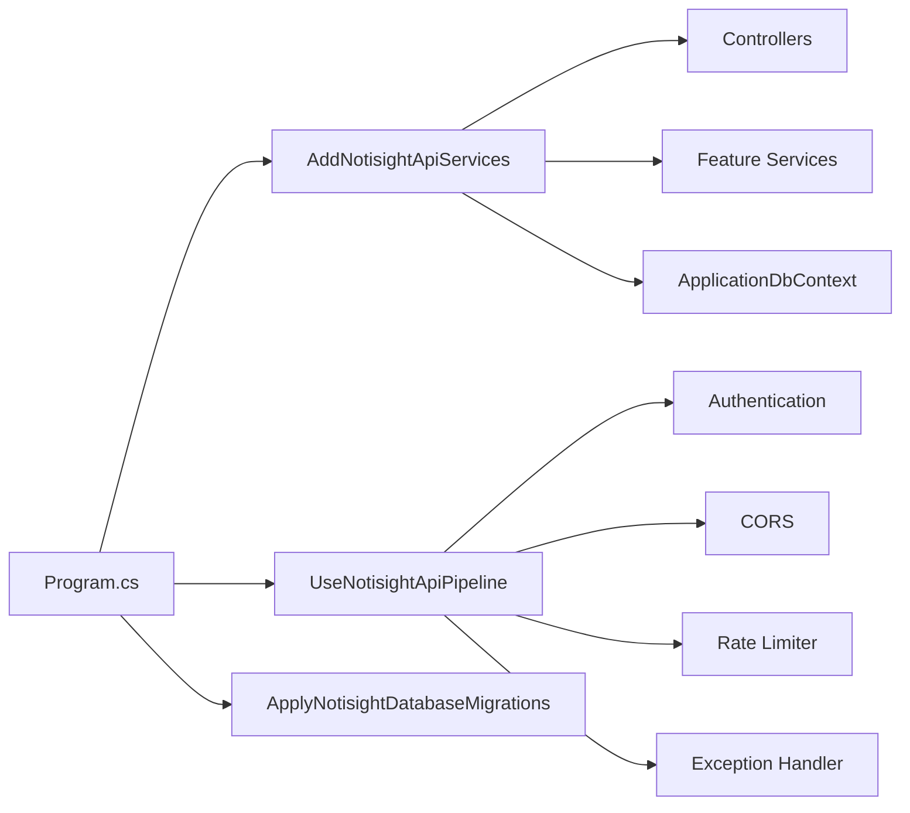
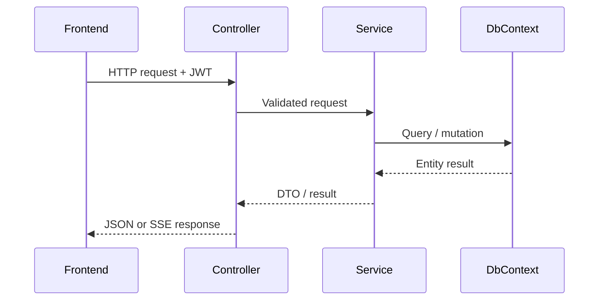

# 04 - Backend Mimarisi

## Genel Yapi

Backend, .NET 8 ASP.NET Core Web API olarak tasarlanmistir. `Program.cs` minimum hosting modelini kullanir ve servis kayitlari ile HTTP pipeline ayarlari extension siniflarina ayrilmistir.

## Pipeline

| Siralama | Middleware / islem | Amac |
|---|---|---|
| 1 | Swagger UI | Development ortaminda API kesfi |
| 2 | Exception handler | Merkezi hata response uretimi |
| 3 | CORS | Frontend origin izinleri |
| 4 | Static files | Upload/file servis destegi |
| 5 | HTTPS redirection | Guvenli iletisim |
| 6 | Rate limiter | Auth ve AI endpointleri icin limit |
| 7 | Authentication | JWT dogrulama |
| 8 | Authorization | Yetki kontrolu |
| 9 | MapControllers | Controller endpointleri |

## Feature-Based Moduler Yapi

Backend klasik katman adlari yerine domain alanlarina gore feature klasorlerine ayrilmistir. Bu tercih, tez acisindan "moduler monolith" olarak anlatilabilir.

| Feature | Controller | Servisler |
|---|---|---|
| Auth | `AuthController` | `AuthService`, `JwtTokenService` |
| Notes | `NotesController`, `NotesUploadController` | `NoteVectorSyncService` |
| Folders | `FoldersController` | DbContext tabanli logic |
| Tags | `TagsController` | DbContext tabanli logic |
| AI | `AiController` | Orchestrator, RAG, retrieval, chat, embedding |
| Settings | `SettingsController` | `SecurityService` |
| Ingestion | `NotesUploadController` | PDF, audio, R2 storage |

## Dependency Injection Kayitlari

| Servis | Lifetime | Aciklama |
|---|---|---|
| `ApplicationDbContext` | Scoped | Request bazli EF Core context |
| `IAuthService` | Scoped | Auth is kurallari |
| `ICurrentUser` | Scoped | JWT claim'den user id okuma |
| `ITextChunkingService` | Scoped | Chunk uretimi |
| `IEmbeddingService` | HttpClient | Gemini embedding |
| `IQdrantVectorService` | HttpClient | Qdrant REST operasyonlari |
| `IQueryOrchestratorService` | Scoped | AI/RAG ana akisi |
| `IToneProfileService` | Singleton | Statik ton profilleri |
| `IFileStorageService` | Scoped | Cloudflare R2 dosya islemleri |

## Merkezi Hata Yonetimi

| Exception | HTTP status |
|---|---|
| `UnauthorizedAccessException` | 401 |
| `KeyNotFoundException` | 404 |
| `InvalidOperationException` | 400 |
| `DbUpdateException` | 409 |
| Diger | 500 |

## Rate Limiting

| Policy | Limit | Pencere | Kullanildigi alan |
|---|---:|---|---|
| `auth` | 20 istek | 1 dakika | register/login/refresh/logout |
| `ai` | 10 istek | 1 dakika | `/ai/ask` |

## Controller Akis Ornegi

