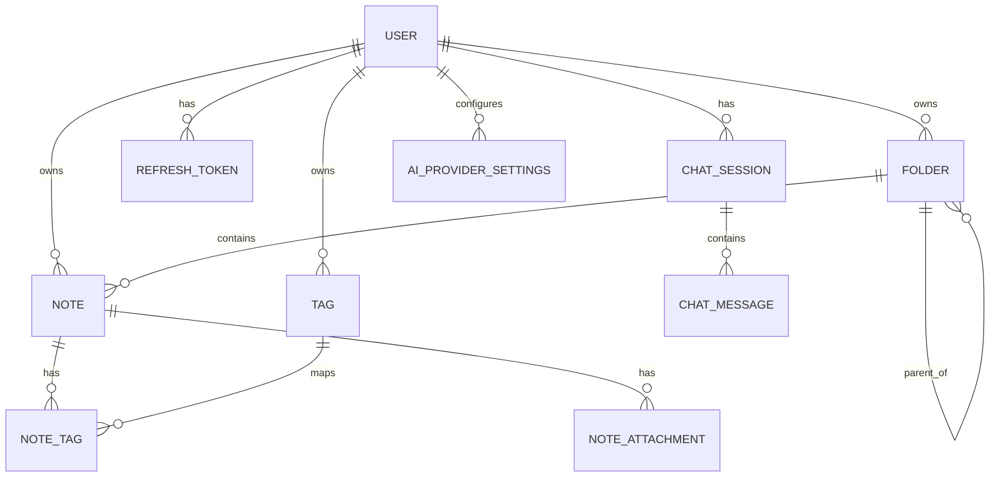

# 05 - Veri Modeli ve Veritabani

## Genel Model

Notisight'in iliskisel veri modeli kullanici merkezlidir. Her not, klasor, etiket, chat session ve AI provider ayari bir kullaniciya baglanir. Bu sayede cok kullanicili sistemde veri izolasyonu saglanir.

## Entity Tablosu

| Entity | Tablo | Temel alanlar | Aciklama |
|---|---|---|---|
| `User` | `users` | Id, Username, Email, PasswordHash, DisplayName | Kullanici hesabi |
| `Folder` | `folders` | Id, UserId, Name, ParentFolderId | Ic ice klasor yapisi |
| `Note` | `notes` | Id, UserId, FolderId, Title, Content, FileUrl, FileType | Ana not varligi |
| `Tag` | `tags` | Id, UserId, Name | Kullanici bazli etiket |
| `NoteTag` | `note_tags` | NoteId, TagId | Many-to-many baglanti |
| `NoteAttachment` | `note_attachments` | Id, NoteId, FileName, ContentType, FileUrl | Not icindeki gorseller |
| `RefreshToken` | `refresh_tokens` | Token, ExpiresAtUtc, RevokedAtUtc | Token rotation |
| `ChatSession` | `chat_sessions` | Id, UserId, Title | Sohbet oturumu |
| `ChatMessage` | `chat_messages` | Role, Content, MetadataJson, Mode | Sohbet mesajlari |
| `AiProviderSettings` | `ai_provider_settings` | ProviderType, EncryptedApiKey, CustomBaseUrl | Kullanici AI ayarlari |

## ER Diyagrami

## Iliski ve Silme Davranislari

| Iliski | Davranis |
|---|---|
| User -> Notes/Folders/Tags/RefreshTokens | Cascade delete |
| Folder -> ParentFolder | Restrict; kendi altina tasima engellenir |
| Note -> Folder | NoAction; klasor silinince not root'a tasinir |
| Note -> NoteAttachments | Cascade delete |
| Note -> NoteTags | Cascade delete |
| Tag -> NoteTags | NoAction; silme sirasinda iliskiler temizlenir |
| ChatSession -> ChatMessages | Cascade delete |

## Vektor Senkronizasyon Alanlari

| Alan | Rol |
|---|---|
| `VectorSyncStatus` | `pending`, `synced`, `failed` durumlarindan biri |
| `VectorSyncError` | Qdrant/embedding hatasinin kisaltilmis mesaji |
| `VectorSyncedAtUtc` | Basarili sync zamani |

## Audit Alanlari

`ApplicationDbContext.SaveChanges` ve `SaveChangesAsync` icinde created/updated alanlari otomatik set edilir.

| Entity | Created | Updated |
|---|---|---|
| User | Var | Var |
| Folder | Var | Var |
| Note | Var | Var |
| Tag | Var | Yok |
| RefreshToken | Var | RevokedAt ayrica tutulur |
| ChatSession | Var | Var |
| ChatMessage | Var | Yok |
| AiProviderSettings | Var | Var |

## Migration Mantigi

Backend acilista `Database:SkipMigrations` false ise `dbContext.Database.Migrate()` calistirir. Test ortaminda bu bayrak true yapilarak SQLite in-memory veritabani `EnsureCreated()` ile hazirlanir.
