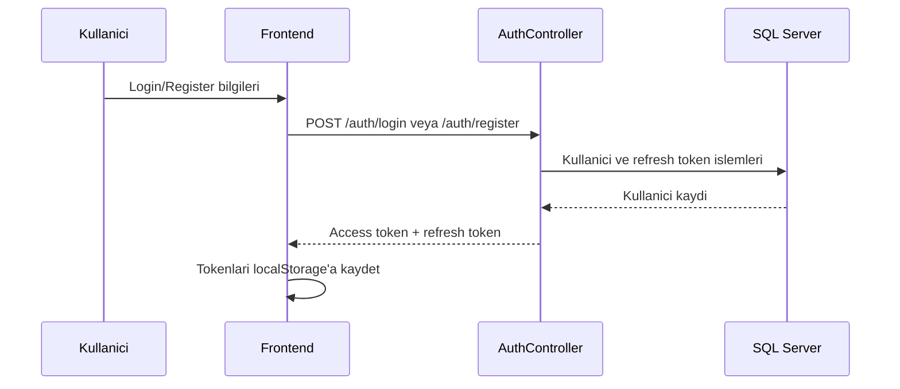

# 06 - Auth ve Guvenlik

## Kimlik Dogrulama Ozeti

Notisight JWT access token ve refresh token rotation yaklasimini kullanir. Parolalar BCrypt ile hashlenir, kullaniciya ait kaynaklara erisim her controller'da `currentUser.GetRequiredUserId()` ile sinirlanir.

## Auth Akislari

## Endpointler

| Endpoint | Amac | Rate limit |
|---|---|---|
| `POST /auth/register` | Yeni kullanici olusturma | `auth` |
| `POST /auth/login` | Email veya username ile giris | `auth` |
| `POST /auth/refresh` | Access token yenileme | `auth` |
| `POST /auth/logout` | Refresh token iptali | `auth` |
| `GET /auth/me` | Aktif kullanici bilgisi | Yok |
| `PUT /auth/profile` | Profil guncelleme | Yok |
| `PUT /auth/password` | Parola degistirme | Yok |

## JWT Icerigi

| Claim | Aciklama |
|---|---|
| `sub` | Kullanici Id |
| `nameidentifier` | Kullanici Id |
| `email` | Kullanici email |
| `name` | DisplayName |
| `username` | Kullanici adi |
| `jti` | Token benzersiz kimligi |

## Refresh Token Rotation

Refresh endpointi mevcut aktif refresh tokeni bulur, yeni token seti uretir, eski tokenin `RevokedAtUtc` alanini set eder ve `ReplacedByToken` ile yeni tokena referans verir. Bu yaklasim token tekrar kullanim riskini azaltir.

## Parola Guvenligi

| Katman | Davranis |
|---|---|
| Frontend | En az 8 karakter, buyuk harf, kucuk harf ve sayi kontrolu |
| Backend | BCrypt hash ve verify |
| Profil guncelleme | Email ve username duplicate kontrolu |
| Parola degistirme | Mevcut parola dogrulanmadan yeni parola set edilmez |

## API Anahtari Guvenligi

Kullanici bazli AI provider anahtarlari `AiProviderSettings.EncryptedApiKey` alaninda sifreli tutulur. `SettingsController`, anahtar goruntulemede tam degeri donmez; yalnizca masked key bilgisi uretir.

## Secret Yonetimi

Gercek secret degerleri dokumana veya repoya yazilmamalidir. Kullanilacak alan adlari:

| Config section | Ornek alanlar |
|---|---|
| `Jwt` | Issuer, Audience, SigningKey, AccessTokenMinutes, RefreshTokenDays |
| `Gemini` | ApiKey, ChatModel, EmbeddingModel |
| `Qdrant` | Url veya Endpoint, ApiKey, CollectionName, VectorSize |
| `Rag` | ChunkTokenTarget, ChunkOverlapPercent, TopK, MinVectorScore |
| `CloudflareR2` | BucketName, AccessKey, SecretKey, EndpointUrl, PublicUrlPrefix |

## Kullanici Izolasyonu

| Kaynak | Izolasyon yontemi |
|---|---|
| Notes | `UserId == currentUserId` filtresi |
| Folders | Parent ve CRUD islemlerinde user kontrolu |
| Tags | User bazli unique name |
| Chat sessions | SessionId + UserId kontrolu |
| Qdrant search | Payload filter: `userId` |
