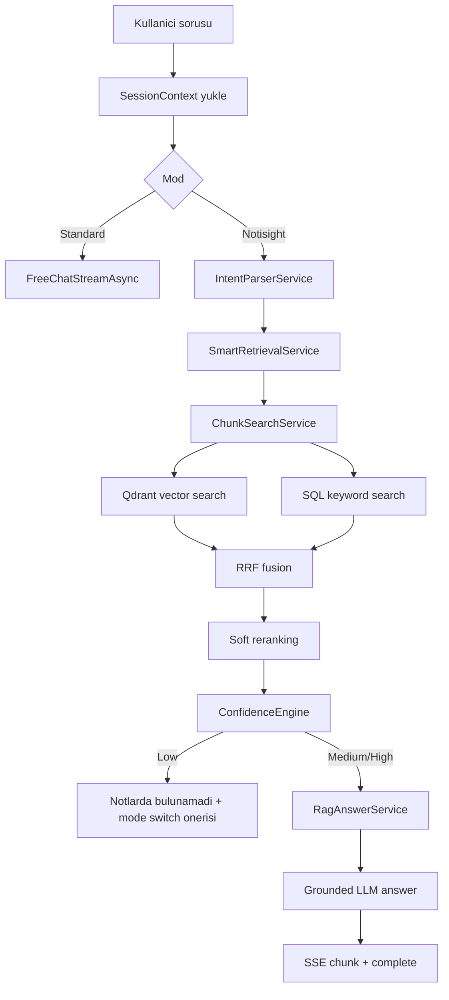
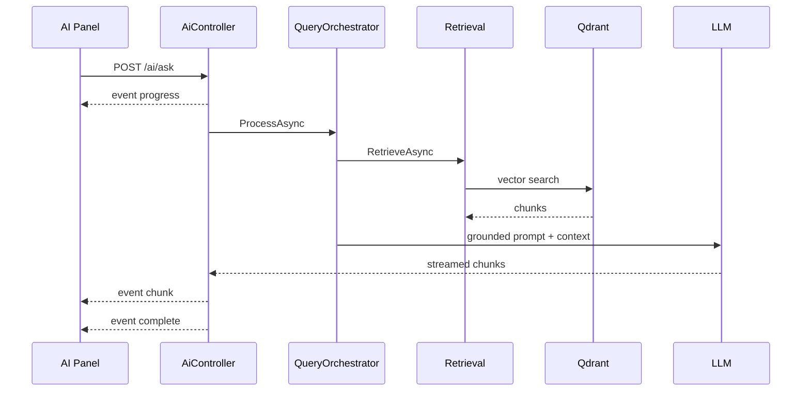

# 07 - AI ve RAG Mimarisi

## Modlar

Notisight iki AI calisma modu sunar.

| Mod | Backend enum | Davranis |
|---|---|---|
| Standard | `ChatMode.Standard` | RAG hattina girmez, secili LLM ile serbest sohbet eder |
| Notisight | `ChatMode.Notisight` | Intent, retrieval, confidence ve grounded answer hattini calistirir |

## RAG Akis Diyagrami

## Katmanlar

| Katman | Servis | Gorev |
|---|---|---|
| Oturum baglami | `SessionContextService` | Son turlar, aktif mod, aktif ton, erisilen kaynaklar |
| Intent | `IntentParserService` | Soru niyeti, optimized query, key entities, source hint |
| Retrieval | `SmartRetrievalService` | Hybrid arama sonucunu rerank eder |
| Search | `ChunkSearchService` | Vector + keyword arama ve RRF fusion |
| Confidence | `ConfidenceEngineService` | Chunk sayisi ve skora gore dusuk/orta/yuksek |
| Answer | `RagAnswerService` | Context chunk'lari LLM prompt'una ekler |
| Chat | `OpenAiChatService` | OpenAI-compatible streaming/non-streaming chat |

## SSE Cevap Yapisi

`POST /ai/ask` endpointi `text/event-stream` doner.

| Event | Icerik | Amac |
|---|---|---|
| `progress` | `{ step }` | UI'da islem asamasi gosterimi |
| `chunk` | `{ content }` | Streaming cevap parcasi |
| `complete` | sources, citations, sessionId, confidence, mode, tone | Final metadata |
| `error` | `{ message }` | Hata bildirimi |

## Citation Mantigi

RAG cevabi uretilirken her context parcasi `[ID: c1]` formatinda LLM'e verilir. Cevap tamamlandiktan sonra `RagAnswerService.ParseCitations` bu ID'leri yakalar ve `CitationReference` listesine cevirir.

| Alan | Aciklama |
|---|---|
| `RefId` | c1, c2 gibi chunk referansi |
| `NoteId` | Kaynak not |
| `Title` | Kaynak basligi |
| `SourceType` | note, pdf, audio |
| `SourceLabel` | Sayfa veya tahmini zaman etiketi |
| `Snippet` | Kisa kaynak metni |

## Ton Profilleri

| Ton | Enum | Amac |
|---|---|---|
| Samimi | `Casual` | Kisa, net, arkadasca |
| Teknik | `Technical` | Jargon ve mekanizma detayi |
| Ogretici | `Pedagogical` | Adim adim anlatim |
| Resmi | `Formal` | Profesyonel dil |

## Sequence Diyagrami

## Mevcut Implementasyon Notlari

LLM chat servisi `OpenAiChatService` adini tasir, ancak kodda farkli provider'lar icin OpenAI-compatible `/chat/completions` endpointi kullanacak sekilde genellestirilmistir. Embedding Gemini API ile, ses transkripsiyonu ise Deepgram API ile ayrica yapilir.
