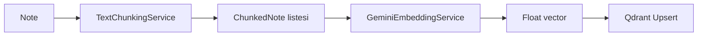
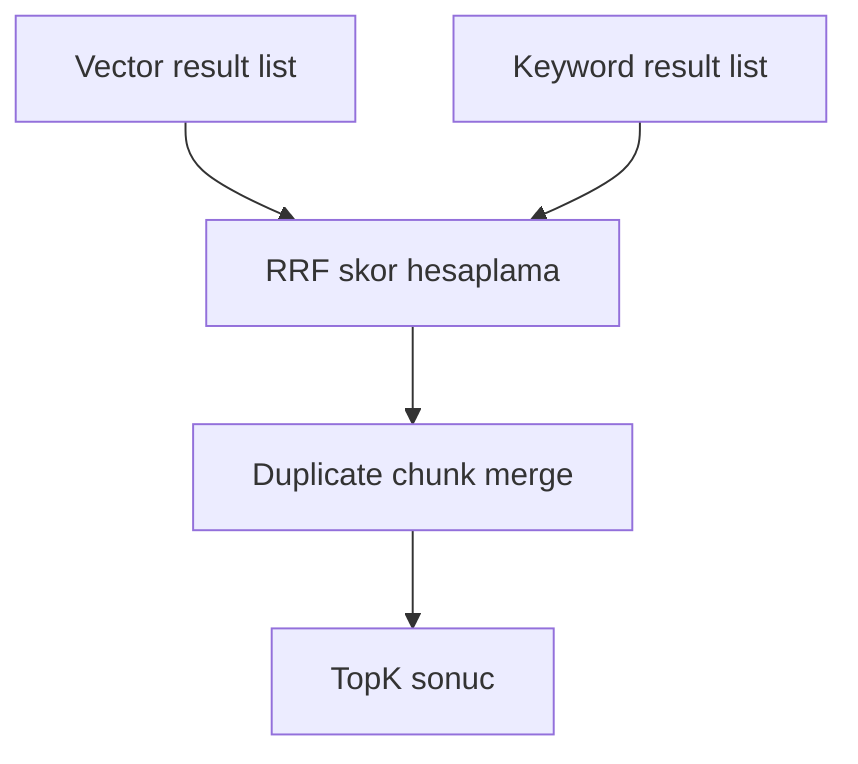

# 08 - Vektorlestirme ve Semantik Baglam

## Vektorlestirme Amaci

Vektorlestirme, not metinlerini anlamsal olarak aranabilir hale getirir. Kullanici sorusu ile not parcasi birebir ayni kelimeleri icermese bile embedding uzayinda yakin ise retrieval asamasinda bulunabilir.

## Chunking Stratejisi

| Kaynak | Metot | SourceType | SourceLabel |
|---|---|---|---|
| Rich text not | HTML temizleme + cumle bazli chunk | `note` | bos |
| PDF | Sayfa metni + cumle bazli chunk | `pdf` | `Sayfa N` |
| Ses | Transkript + cumle bazli chunk | `audio` | tahmini `~MM:SS` |

Varsayilan ayarlar:

| Ayar | Varsayilan |
|---|---:|
| `ChunkTokenTarget` | 300 |
| `ChunkOverlapPercent` | 20 |
| `TopK` | 8 |
| `VectorSize` | 768 |

## Embedding Akisi

## Qdrant Collection

| Ozellik | Deger |
|---|---|
| Collection name | `notisight_chunks` |
| Distance | Cosine |
| Vector size | Config ile 768 varsayilan |
| Payload index | `noteId`, `userId` |

## Payload Alanlari

| Alan | Amac |
|---|---|
| `userId` | Cok kullanicili izolasyon |
| `noteId` | Not yasam dongusu ve kaynak referansi |
| `title` | Kaynak basligi |
| `content` | Chunk metni |
| `index` | Not icindeki chunk sirasi |
| `sourceType` | note/pdf/audio ayrimi |
| `sourceLabel` | sayfa veya zaman etiketi |

## Hybrid Search

`ChunkSearchService`, semantik aramayi kelime bazli arama ile birlestirir.

| Asama | Aciklama |
|---|---|
| Vector search | Sorgu embedding'i Qdrant'ta aranir |
| Keyword search | SQL'deki notlar parcalanir, soru kelimeleri ve key entity'ler eslestirilir |
| RRF fusion | Iki sirali liste Reciprocal Rank Fusion ile birlestirilir |
| Soft boost | SourceType ve key entity baslik/icerik eslesmeleri ek puan alir |

## RRF Mantigi

## Note Lifecycle ve Sync Status

| Islem | Qdrant davranisi | SQL status |
|---|---|---|
| Not olusturma | Once eski noteId silinir, sonra chunk upsert edilir | `synced` veya `failed` |
| Not guncelleme | Eski chunk'lar silinir, yeni chunk'lar yazilir | `synced` veya `failed` |
| Not silme | noteId filtresiyle Qdrant point'leri silinir | SQL kaydi silinir |
| Upsert hatasi | Not SQL'de kalir | `failed`, hata mesaji saklanir |

## Deterministik Embedding Fallback

Gemini API anahtari yoksa servis test/geliştirme amacli deterministik hash tabanli embedding uretir. Bu davranis production kalitesi icin degil, dis servissiz test edilebilirlik icindir.
