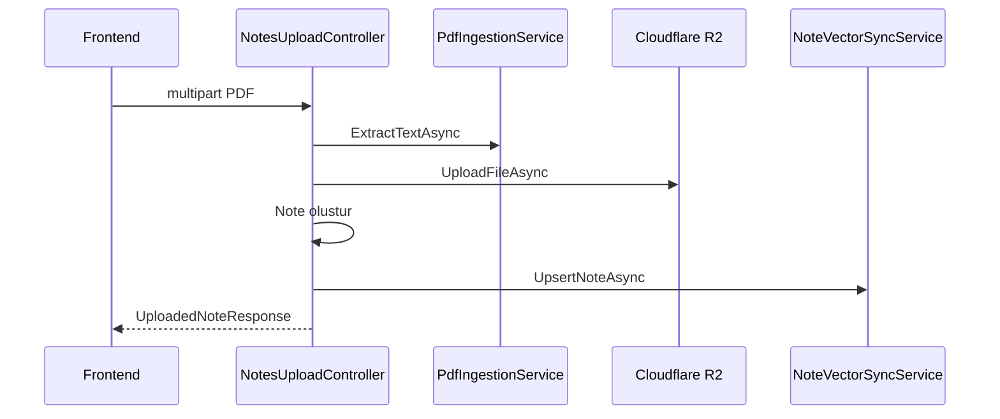
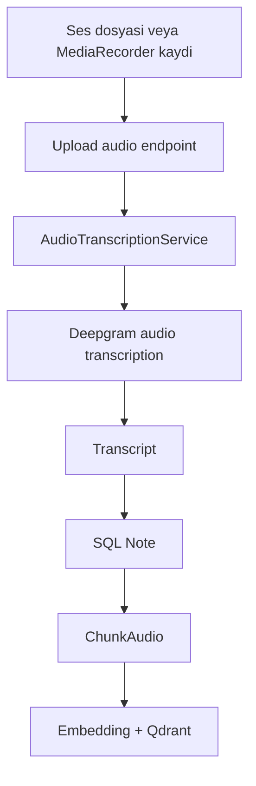

# 09 - Ingestion: Dosya, Ses ve PDF

## Genel Bakis

Ingestion katmani, farkli formatlardaki bilgiyi Notisight'in ortak not modeline donusturur. PDF ve ses dosyalari once orijinal dosya olarak R2'ye yuklenir, ardindan metinsel icerikleri SQL not kaydina ve Qdrant vektor indeksine aktarilir.

## Upload Endpointleri

| Endpoint | Format | Limit | Sonuc |
|---|---|---:|---|
| `POST /notes/upload-pdf` | `.pdf` | 20 MB | PDF metninden not |
| `POST /notes/upload-audio` | `.wav`, `.webm`, `.m4a`, `.mp3` | 25 MB | Transkriptten not |
| `POST /notes/{noteId}/attachments` | `.jpg`, `.jpeg`, `.png`, `.gif`, `.webp` | 15 MB | Not icine gorsel attachment |

## PDF Akisi

## Ses Akisi

## R2 Storage

| Metot | Gorev |
|---|---|
| `UploadFileAsync` | Dosyayi benzersiz object key ile yukler |
| `DeleteFileAsync` | Note veya attachment silinince object'i siler |
| `GetFileStreamAsync` | PDF/ses/gorsel goruntuleme icin stream acar |
| `DownloadFileAsync` | PDF page extraction fallback icin dosyayi indirir |

## PDF Goruntuleme

Frontend `react-pdf` ile backend'deki `/notes/{id}/file` endpointinden PDF blob'unu ceker. Token varsa Authorization header kullanilir. UI sayfalari render eder ve zoom kontrolu sunar.

## Ses Goruntuleme

Audio viewer backend'den ses blob'unu alir, object URL uretir ve HTML audio API ile oynatma, duraklatma, seek, mute ve playback speed kontrolu saglar. Transkript not icerigi olarak ayni ekranda gosterilir.

## Image Attachment Akisi

Editor icinde gorsel paste veya drag/drop yapildiginda frontend multipart upload yapar. Backend R2'ye yukleyip attachment kaydi olusturur. UI donen file URL ile TipTap image node ekler.

## Hata ve Validasyonlar

| Kontrol | Davranis |
|---|---|
| Bos dosya | Bad request |
| Yanlis PDF uzantisi | Sadece PDF desteklenir |
| Yanlis ses uzantisi | Sadece WAV, WEBM, M4A, MP3 desteklenir |
| Audio API key yok | Transcription icin hata |
| R2 delete hatasi | Loglanir, not silme akisi devam eder |
