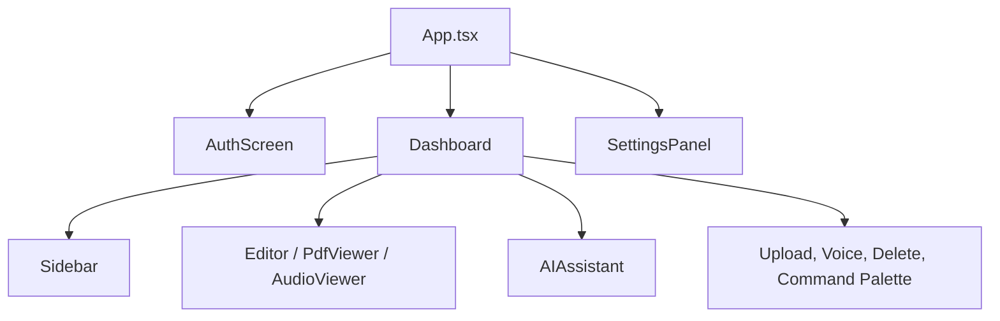

# 10 - Frontend Mimarisi

## Genel Yapi

Frontend Vite, React ve TypeScript ile gelistirilmis tek sayfa uygulamadir. Koken `App.tsx`, localStorage'daki access token durumuna gore auth, ana uygulama veya ayarlar gorunumunu render eder.

## Ana Ekran

`Dashboard`, uygulamanin calisma alanidir.

| Panel | Bilesen | Gorev |
|---|---|---|
| Sol | `Sidebar` | Klasor ve not agaci, yeni not/klasor, upload, ayarlar |
| Orta | `Editor`, `PdfViewer`, `AudioViewer` | Aktif notun turune gore editor veya viewer |
| Sag | `AIAssistant` | AI chat, mod, ton ve model secimi |

Paneller masaustu ekranda yeniden boyutlandirilabilir. Mobilde sidebar ve AI paneli ac/kapat dugmeleriyle kontrol edilir.

## State Yonetimi

| State | Bulundugu yer | Aciklama |
|---|---|---|
| `view` | `App.tsx` | auth/app/settings secimi |
| `folders` | `Dashboard` | Klasor agaci ve notlar |
| `activeNoteId` | `Dashboard` | Acik aktif not |
| `openNoteIds` | `Dashboard` | Sekme mantigi |
| `sessions` | `AIAssistant` | Chat oturumlari |
| `sightMode` | `AIAssistant` | Notisight veya Standard mode |
| `activeTone` | `AIAssistant` | AI ton secimi |
| `selectedProvider/model` | `AIAssistant` | Chat provider/model secimi |

## API Client

`apiClient.ts` token ekleme, refresh ve hata donusturme mantigini merkezilestirir.

| Davranis | Aciklama |
|---|---|
| Access token | `Authorization: Bearer` header olarak eklenir |
| 401 handling | Refresh token ile tekrar denenir |
| Refresh basarisiz | Tokenlar temizlenir, `auth:unauthorized` event'i yayinlanir |
| Error parsing | ProblemDetails, message veya plain text okunur |

## Editor

TipTap editoru su ozellikleri destekler:

| Ozellik | Aciklama |
|---|---|
| Rich text | Bold, italic, underline, heading, list, quote, code |
| Slash menu | `/` ile blok komutlari |
| Debounced autosave | 600 ms bekleme ile note update |
| Image paste/drop | Gorseli attachment endpointine yukler |
| Secim menusu | Rewrite/explain/continue mock AI aksiyonlari |

## AI Assistant UI

| Ozellik | Aciklama |
|---|---|
| SSE parsing | `progress`, `chunk`, `complete`, `error` eventlerini okur |
| Markdown render | `react-markdown` ile cevap render eder |
| Citation UI | `[ID: c1]` referanslarini tiklanabilir kaynak rozetlerine cevirir |
| Mode switch | Notisight/Standard toggle |
| Tone dropdown | `/ai/tones` endpointinden ton profillerini ceker |
| Provider/model | Kullanici ayarlarinda tanimli provider'lar arasindan secim |

## LocalStorage Kullanimi

| Anahtar | Amac |
|---|---|
| `accessToken`, `refreshToken` | Auth tokenlari |
| `theme` | Koyu/acik/sistem tema |
| `avatarSeed` | Dicebear avatar seed |
| `notisight_open_sessions` | Acik chat session tablari |
| `notisight_ai_provider` | Secili AI provider |
| `notisight_ai_model` | Secili model |
| `notisight_ai_custom_model` | Ozel model id |

## Mevcut Sinirlilik

Command palette icindeki son notlar statik orneklerdir. Gercek global arama icin backend endpointi ve frontend filtreleme baglantisi eklenebilir.
