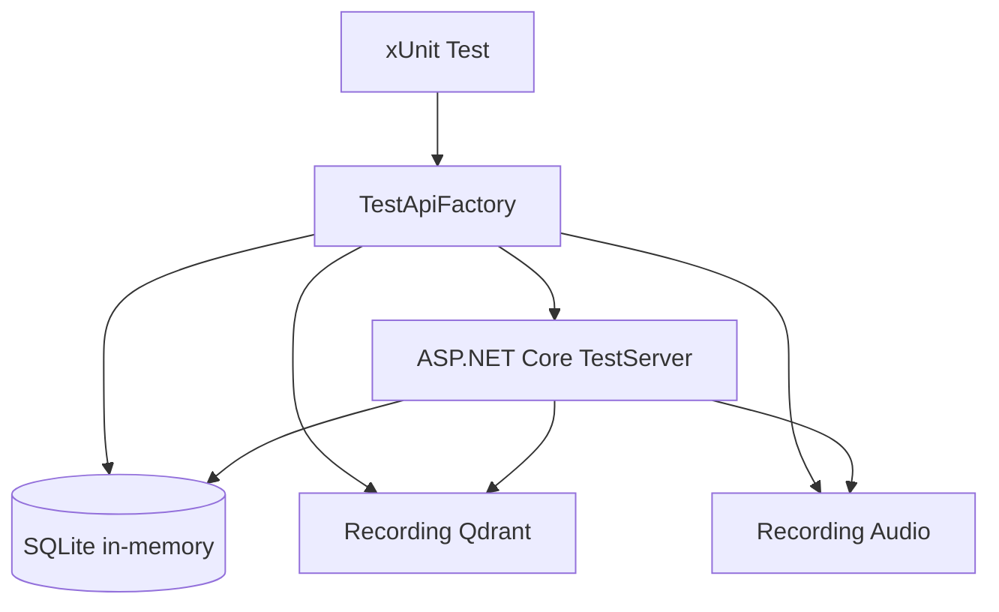

# 12 - Test Stratejisi

## Test Yaklasimi

Backend testleri xUnit ve `WebApplicationFactory<Program>` ile entegrasyon testi formatinda yazilmistir. Test ortami gercek HTTP pipeline'i calistirir fakat dis bagimliliklari fake servislerle degistirir.

## Test Altyapisi

| Bilesen | Testteki karsiligi |
|---|---|
| SQL Server | SQLite in-memory |
| Qdrant | `RecordingQdrantVectorService` |
| Audio transcription | `RecordingAudioTranscriptionService` |
| JWT config | In-memory configuration |
| Migration | Testte `Database:SkipMigrations=true`, `EnsureCreated()` |

## Test Dosyalari

| Dosya | Kapsam |
|---|---|
| `AuthLifecycleTests.cs` | Auth lifecycle, duplicate kontrol, weak password, profil, parola |
| `CrudIsolationTests.cs` | Kullanici izolasyonu ve klasor parent kurallari |
| `NoteVectorLifecycleTests.cs` | Not create/update/delete ve vektor store sync |
| `IngestionEndpointTests.cs` | PDF/audio upload validasyonlari ve audio indexing |
| `AiStreamingTests.cs` | SSE response ve source reference |
| `JwtTokenServiceTests.cs` | Token uretim davranisi |

## Kapsanan Senaryolar

| Senaryo | Beklenen sonuc |
|---|---|
| Register-login-refresh-logout | Token setleri dogru uretilir ve iptal edilir |
| Username/email login | Iki identifier tipi de desteklenir |
| Duplicate email/username | Bad request |
| Weak password | Bad request |
| Kullanici izolasyonu | Baska kullanici notlari gorulemez |
| Klasor parent guncelleme | Baska kullanici parent'i ve descendant parent reddedilir |
| Not vector lifecycle | Create/update/delete Qdrant delete/upsert cagirir |
| Vector upsert failure | Not SQL'de kalir, status `failed` olur |
| Yanlis upload uzantisi | Bad request |
| WAV upload | Transcript not olur ve indekslenir |
| AI ask | SSE chunk ve complete eventleri doner |

## Test Diyagrami



## Calistirma

```powershell
dotnet test backend/tests/Notisight.Api.Tests/Notisight.Api.Tests.csproj
```

## Gelistirme Onerileri

| Eksik alan | Oneri |
|---|---|
| Frontend otomasyon testleri | Playwright ile auth, upload ve AI panel smoke testleri |
| RAG kalite testi | Kontrollu not setiyle expected source/citation dogrulama |
| Security testleri | API key masking ve authorization boundary testlerini genisletme |
| Load test | AI rate limit ve SSE davranisini yuk altinda test etme |
