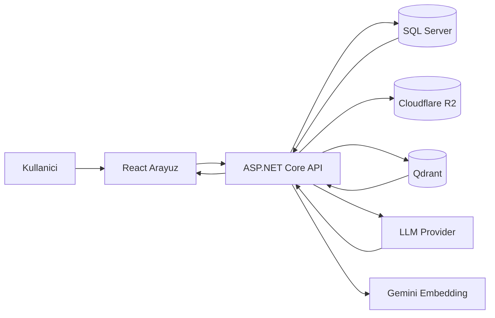

# 14 - Tez Icin Anlatim Rehberi

## Akademik Ozet Taslagi

Notisight, kisisel bilgi yonetimi problemi icin gelistirilmis web tabanli bir not asistanidir. Sistem, metin, PDF ve ses kaynaklarini ortak bir not modeli altinda toplar; bu icerikleri parcalara ayirip vektorlestirerek anlamsal arama yapilabilir hale getirir. Kullanici sorulari, Retrieval-Augmented Generation yaklasimi ile ilgili not parcalari baglam olarak kullanilarak cevaplanir. Bu sayede modelin yalnizca genel bilgisine dayanan cevaplar yerine kullanicinin kendi bilgi havuzuna dayali, kaynak referansli cevaplar uretilir.

## Tez Bolumlerine Dagitim Onerisi

| Tez bolumu | Kullanilabilecek dokumanlar |
|---|---|
| Giris | `01-proje-genel-bakis.md` |
| Literatür / Kavramsal Arka Plan | `07-ai-rag-mimarisi.md`, `08-vektorlestirme-ve-semantik-baglam.md` |
| Yontem | `04-backend-mimarisi.md`, `05-veri-modeli-ve-veritabani.md` |
| Sistem Tasarimi | `03-dosya-ve-klasor-yapisi.md`, `10-frontend-mimarisi.md` |
| Uygulama | `09-ingestion-dosya-ses-pdf.md`, `11-api-endpointleri.md` |
| Test ve Degerlendirme | `12-test-stratejisi.md` |
| Sonuc ve Gelecek Calismalar | Bu dokumandaki gelistirme onerileri |

## Mimari Karar Gerekceleri

| Karar | Gerekce |
|---|---|
| ASP.NET Core backend | Guvenilir API, middleware ve DI destegi |
| Feature-based klasorleme | Domain alanlarina gore bakimi kolay moduler yapi |
| EF Core + SQL Server | Iliskisel veri modeli ve migration destegi |
| Qdrant kullanimi | Vektor arama icin amaca ozel veritabani |
| Hybrid retrieval | Sadece vektor veya sadece keyword aramanin eksiklerini azaltma |
| SSE streaming | AI cevabini kullaniciya bekletmeden parcali gosterme |
| OpenAI-compatible chat | Birden fazla provider'i ortak arayuzle kullanma |
| Vite/React frontend | Hizli gelistirme ve zengin SPA deneyimi |
| TipTap editor | Not alma icin rich text ve blok tabanli deneyim |

## Guclu Yonler

| Alan | Guclu yon |
|---|---|
| Cok formatli bilgi | Metin, PDF, ses ve gorsel attachment destegi |
| RAG mimarisi | Cevaplarin kullanici notlarina dayandirilmasi |
| Kaynak gosterimi | Citation ve source reference modeli |
| Kullanici izolasyonu | SQL ve Qdrant seviyesinde userId filtreleri |
| Test edilebilirlik | Qdrant ve audio servislerinin fake implementasyonlari |
| Esneklik | Coklu AI provider ve custom model secimi |

## Sinirliliklarin Akademik Ifadesi

| Sinirlilik | Tezde ifade onerisi |
|---|---|
| SessionContext memory cache | "Oturum baglami ilk surumde bellek ici tutulmustur; yatay olcekleme icin kalici/distributed cache gereklidir." |
| Command palette statik ornekler | "Komut paleti arayuz iskeleti hazirdir; tam metin arama entegrasyonu gelecek calisma olarak planlanabilir." |
| Yaklasik audio timestamp | "Ses kaynaklarinda zaman etiketleri transkript oranina dayali tahmini olarak uretilmektedir." |
| LLM provider farklari | "OpenAI-compatible endpoint varsayimi, provider bazli API farkliliklari icin adaptor katmani ile genisletilebilir." |

## Gelecek Calismalar

1. Distributed cache veya veritabani destekli session context.
2. Frontend icin Playwright tabanli end-to-end testler.
3. RAG kalitesini olcmek icin sabit veri seti ve metrikler.
4. Kullanici geri bildirimiyle citation dogrulugu puanlama.
5. Command palette icin gercek not/etiket arama entegrasyonu.
6. Audio transcription icin segment bazli timestamp.
7. Provider bazli LLM adaptorleri ve model capability matrisi.
8. Production observability: structured logs, tracing ve AI latency metrikleri.

## Tezde Kullanilabilecek Sistem Diyagrami

## Sonuc Cumlesi Taslagi

Bu calisma, kisisel notlarin yalnizca saklanan metinler olmaktan cikarilip anlamsal olarak sorgulanabilir bir bilgi tabanina donusturulebilecegini gostermektedir. Notisight'in RAG tabanli mimarisi, kullanicinin kendi verisine dayali cevap uretimi, kaynak gosterimi ve cok formatli ingestion ozellikleri ile modern yapay zeka destekli bilgi yonetimi uygulamalarina uygulanabilir bir ornek sunmaktadir.
