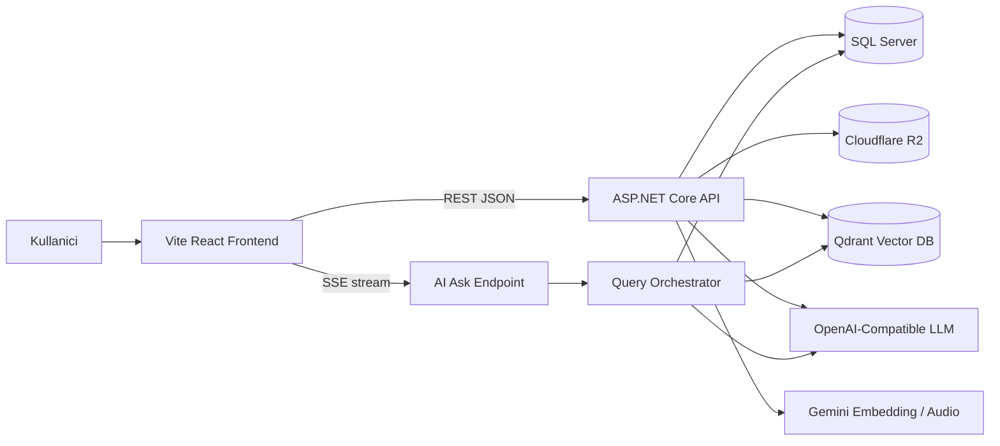

# Notisight Tez Dokumantasyonu

Bu klasor, Notisight projesinin bitirme tezi icin teknik yardimci dokumantasyon setidir. Icerik, proje kaynak kodu incelenerek mevcut implementasyona gore hazirlanmistir. Eski plan dokumanlarinda gecen fakat mevcut kodda kullanilmayan tercihler, ornegin Next.js hedefi, mevcut durum gibi sunulmamistir. Mevcut frontend Vite ve React tabanlidir.

## Projenin Amaci

Notisight; metin, PDF ve ses tabanli notlari tek bir kisisel bilgi alaninda toplayan, bu notlar uzerinde anlamsal arama ve kaynakli soru-cevap deneyimi sunan bir not asistanidir. Sistem klasik not alma ozelliklerini Retrieval-Augmented Generation (RAG) yaklasimi ile birlestirir.

## Problem Tanimi

Kisisel notlar farkli formatlarda daginik halde tutuldugunda kullanici bilgiyi tekrar bulmakta zorlanir. Anahtar kelime aramasi, anlamca benzer fakat kelime olarak farkli sorulari yakalamakta yetersiz kalabilir. Notisight bu problemi notlari parcalara ayirip vektorlestirerek ve soru-cevap asamasinda ilgili parcalari LLM'e baglam olarak vererek cozer.

## Hedef Kullanici

| Kullanici tipi | Ihtiyac | Notisight karsiligi |
|---|---|---|
| Ogrenci | Ders notlarini, PDF dokumanlarini ve ses kayitlarini sorgulama | PDF/ses ingestion ve RAG cevaplama |
| Arastirmaci | Kaynaklardan alinti ve baglam bulma | Citation ve kaynak referansi |
| Bireysel bilgi calisani | Kisisel notlar arasinda hizli arama | Qdrant destekli anlamsal arama |
| Gelistirici | Teknik notlari organize etme | Klasor, etiket, rich text editor |

## Kisa Teknoloji Tablosu

| Katman | Teknoloji | Rol |
|---|---|---|
| Backend | .NET 8 ASP.NET Core Web API | REST/SSE API, auth, RAG orkestrasyonu |
| ORM | Entity Framework Core 8 | SQL Server veri erisimi ve migration |
| Veritabani | Microsoft SQL Server | Kullanici, not, klasor, chat ve ayar verileri |
| Frontend | Vite, React 19, TypeScript | Tek sayfa uygulama ve arayuz |
| Stil | Tailwind CSS v4 | Tema ve responsive UI |
| Editor | TipTap | Rich text not editoru |
| Vektor DB | Qdrant | Chunk embedding saklama ve semantic search |
| Embedding | Gemini embedding modeli | Dokuman ve sorgu vektorleri |
| LLM | OpenAI-compatible chat API'leri | Standard chat ve grounded RAG cevaplari |
| Dosya depolama | Cloudflare R2 / S3 API | PDF, ses ve gorsel dosya saklama |
| Test | xUnit, WebApplicationFactory, SQLite in-memory | Backend entegrasyon testleri |

## Ust Seviye Mimari

## Dokuman Indeksi

1. [Proje Genel Bakis](01-proje-genel-bakis.md)
2. [Teknoloji Yigini](02-teknoloji-yigini.md)
3. [Dosya ve Klasor Yapisi](03-dosya-ve-klasor-yapisi.md)
4. [Backend Mimarisi](04-backend-mimarisi.md)
5. [Veri Modeli ve Veritabani](05-veri-modeli-ve-veritabani.md)
6. [Auth ve Guvenlik](06-auth-ve-guvenlik.md)
7. [AI ve RAG Mimarisi](07-ai-rag-mimarisi.md)
8. [Vektorlestirme ve Semantik Baglam](08-vektorlestirme-ve-semantik-baglam.md)
9. [Ingestion: Dosya, Ses ve PDF](09-ingestion-dosya-ses-pdf.md)
10. [Frontend Mimarisi](10-frontend-mimarisi.md)
11. [API Endpointleri](11-api-endpointleri.md)
12. [Test Stratejisi](12-test-stratejisi.md)
13. [Kurulum ve Calistirma](13-kurulum-ve-calistirma.md)
14. [Tez Icin Anlatim Rehberi](14-tez-icin-anlatim-rehberi.md)

## Onemli Guvenlik Notu

Bu dokuman setinde gercek API anahtari, token, connection string parolasi veya local development secret degeri yer almaz. Yapilandirma ornekleri yalnizca alan adlarini ve placeholder degerleri gosterir.
