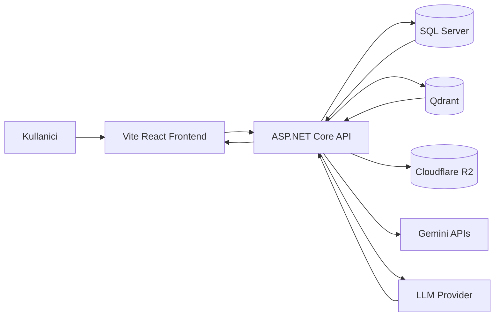
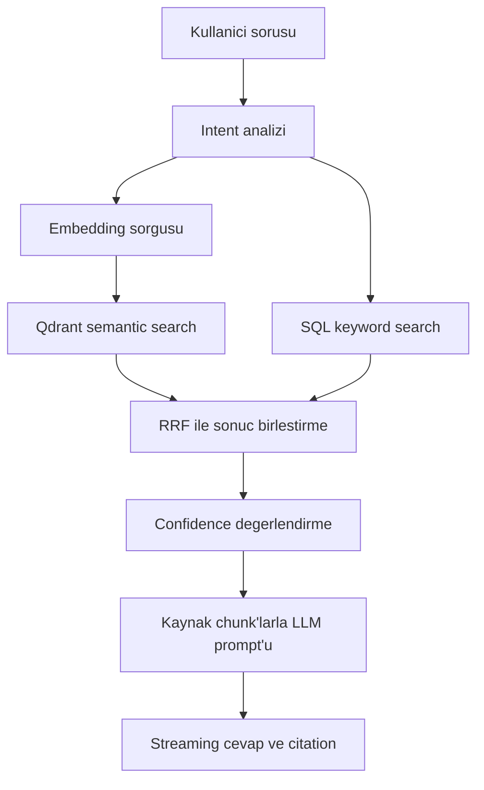

# Notisight

Notisight; metin, PDF ve ses formatindaki kisisel notlari tek bir calisma alaninda toplayan, bu notlar uzerinde yapay zeka destekli anlamsal arama ve kaynakli soru-cevap deneyimi sunan bir not asistanidir.

Uygulama, klasik not alma ozelliklerini Retrieval-Augmented Generation (RAG) mimarisiyle birlestirir. Kullanici notlari once SQL veritabaninda saklanir, ardindan parcalara ayrilip embedding vektorlerine donusturulur ve Qdrant uzerinde aranabilir hale getirilir. AI cevaplari, kullanicinin kendi notlarindan bulunan ilgili kaynak parcalar temel alinarak uretilir.

## Ozellikler

- Kullanici kaydi, giris, JWT access token ve refresh token rotation
- Metin notu olusturma, duzenleme, silme ve otomatik kaydetme
- Ic ice klasor yapisi ve etiket destekli not organizasyonu
- PDF yukleme, metin cikarimi ve PDF goruntuleme
- Ses dosyasi yukleme ve Gemini ile transkripsiyon
- Tarayici uzerinden ses kaydi alma
- Not, PDF ve ses iceriklerinin chunking ve embedding ile vektorlestirilmesi
- Qdrant tabanli anlamsal arama
- Hybrid retrieval: vektor aramasi + keyword aramasi + RRF birlestirme
- Notisight modu: kaynakli RAG cevaplari
- Standard mod: serbest AI sohbeti
- AI cevaplarinda kaynak ve citation gosterimi
- AI davranis tonu secimi: samimi, teknik, ogretici, resmi
- Coklu AI provider destegi: OpenAI, DashScope, Anthropic, Gemini, DeepSeek, OpenRouter, Grok
- Cloudflare R2 / S3 uyumlu dosya depolama
- React tabanli 3 panelli modern calisma arayuzu

## Teknoloji Yigini

| Katman | Teknoloji |
|---|---|
| Backend | .NET 8, ASP.NET Core Web API |
| ORM | Entity Framework Core 8 |
| Veritabani | Microsoft SQL Server |
| Frontend | Vite, React, TypeScript |
| Stil | Tailwind CSS |
| Editor | TipTap |
| PDF | UglyToad.PdfPig, react-pdf |
| AI Chat | OpenAI-compatible chat completions API |
| Embedding | Gemini embedding modeli |
| Ses transkripsiyon | Gemini inline audio |
| Vektor veritabani | Qdrant |
| Dosya depolama | Cloudflare R2 / S3 API |
| Test | xUnit, WebApplicationFactory, SQLite in-memory |

## Mimari



## RAG Akisi



## Proje Yapisi

```text
NotisightApp/
  backend/
    src/Notisight.Api/
    tests/Notisight.Api.Tests/
    scripts/
    sql/
  frontend/
    src/
    package.json
    vite.config.ts
  docs/
  tez-dokumantasyonu/
  README.md
  Notisight.slnx
```

## Kurulum

### Backend

```powershell
cd backend/src/Notisight.Api
dotnet restore
dotnet run
```

### Frontend

```powershell
cd frontend
npm install
npm run dev
```

Varsayilan frontend API adresi:

```text
http://localhost:5000
```

Gerekirse frontend icin:

```text
VITE_API_URL=http://localhost:5000
```

## Yapilandirma

Gercek API anahtarlari ve connection string bilgileri repoya yazilmamalidir. Local gelistirmede environment variable veya .NET user-secrets kullanilmalidir.

Gerekli temel backend config alanlari:

```text
ConnectionStrings__DefaultConnection=...
Jwt__Issuer=...
Jwt__Audience=...
Jwt__SigningKey=...
Gemini__ApiKey=...
Gemini__ChatModel=gemini-2.5-flash
Gemini__EmbeddingModel=gemini-embedding-001
Qdrant__Url=...
Qdrant__ApiKey=...
Qdrant__CollectionName=notisight_chunks
Qdrant__VectorSize=768
Rag__ChunkTokenTarget=300
Rag__ChunkOverlapPercent=20
Rag__TopK=8
CloudflareR2__BucketName=...
CloudflareR2__AccessKey=...
CloudflareR2__SecretKey=...
CloudflareR2__EndpointUrl=...
CloudflareR2__PublicUrlPrefix=...
```

## Test

Backend testlerini calistirmak icin:

```powershell
dotnet test backend/tests/Notisight.Api.Tests/Notisight.Api.Tests.csproj
```

Testlerde SQL Server yerine SQLite in-memory, Qdrant ve audio transcription icin fake servisler kullanilir.

## Dokumantasyon

Detayli teknik ve tez odakli dokumantasyon icin:

- [Tez Dokumantasyonu](README.md)
- [AI ve RAG Mimarisi](07-ai-rag-mimarisi.md)
- [Vektorlestirme ve Semantik Baglam](08-vektorlestirme-ve-semantik-baglam.md)
- [API Endpointleri](11-api-endpointleri.md)
- [Kurulum ve Calistirma](13-kurulum-ve-calistirma.md)

## Guvenlik Notu

Bu projede kullanici verileri kullanici kimligiyle izole edilir. API anahtarlari sifreli saklanir, parolalar BCrypt ile hashlenir, access token dogrulamasi JWT Bearer middleware ile yapilir. Gercek secret degerleri GitHub'a commit edilmemelidir.
